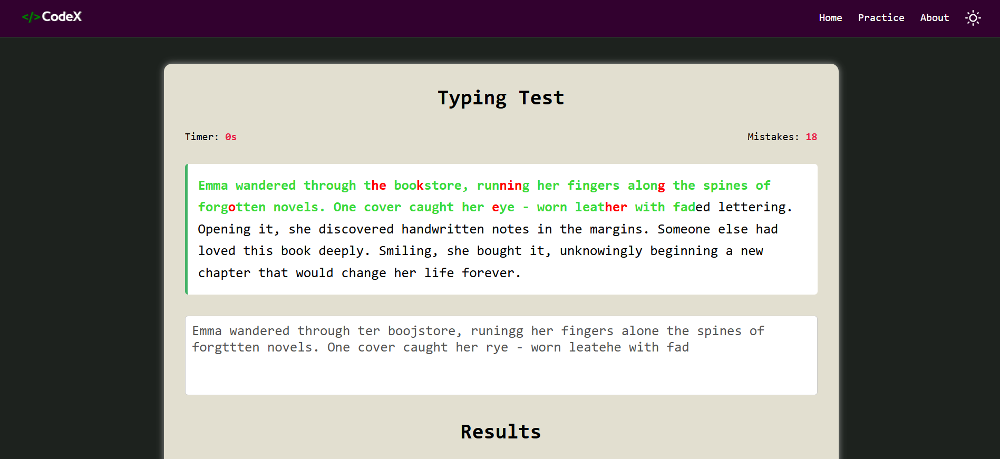
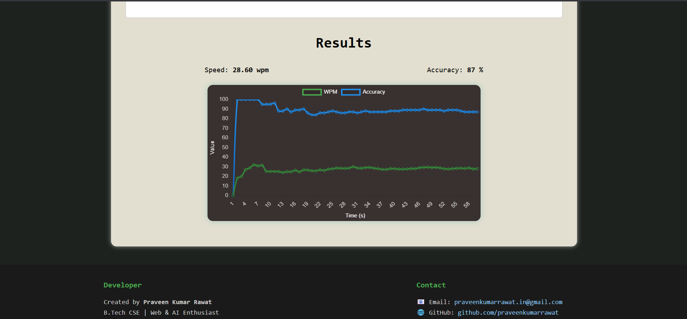

# 🖋️ Typing Master

Typing Master is a web-based application designed to help users improve their typing speed and accuracy through interactive typing tests. It offers real-time feedback on performance, visual error tracking, and a graphical analysis of typing progress.

---

## 🚀 Features

- 🔁 Random quote generator for each test
- ✅ Real-time character-by-character validation:
  - Green for correct characters
  - Red for incorrect ones
- 📊 Visual chart of Words Per Minute (WPM) and Accuracy using Chart.js
- ⏱️ Timer-based typing session
- 📈 Post-test analysis with performance statistics

---

## 🛠️ Technologies Used

- **HTML5**  
- **CSS3**  
- **JavaScript (Vanilla)**  
- **Chart.js** for graphical results

---

## 📷 Project Output Screenshots

### 🧪 Typing Master - Home Page


### 🧪 Typing Test Page


### 📊 Result Analysis


---

## 🧑‍💻 How to Run the Project Locally

1. Clone the repository:
   ```bash
   git clone https://github.com/praveenkumarrawat/Typing-Master.git
